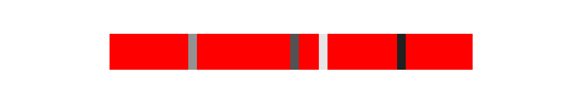
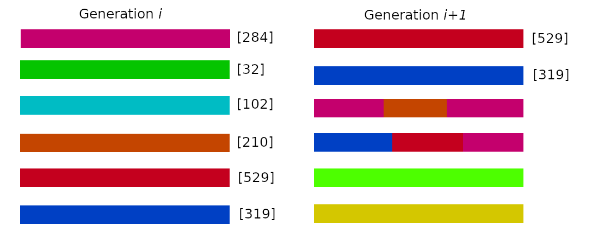
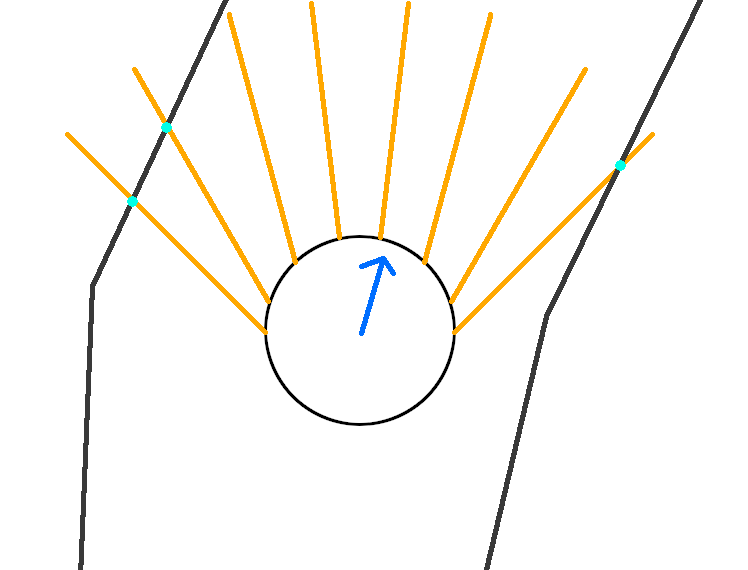

# Projet TER S4

## Build

Initialisation du conteneur docker:
``` bash
docker build -t sfml_env .
```

Compilation:
```bash
./build.sh
```

L'exécutable se trouve dans le dossier **build**.

Dépendances:
```
docker
```

## Fonctionnement

### Réseau de neurones

C'est un réseau feed-forward avec plusieurs couches de neurones. Le nombre de couche et de neurones par couche est entièrement paramétrable.

Les neurones d'entrée sont accessibles par une fonction `setInput` et ceux de sortie par une fonction `getOutput`.

`TODO: screens d'un réseau`

### Évolution

Pour faire évoluer le réseau, nous avons choisi d'utiliser un algorithme génétique. Un gène est la collection de tous les poids connectant les neurones du réseau.

Les réseaux seront évaluer en une note leur sera attribuée, puis une étape de sélection et de combinaison permet de créer une nouvelle génération de réseaux.

### Évaluation

Pour évaluer les réseaux, nous allons regarder la distance parcourue par l'agent. Au plus il va loin, au plus son score augmentera. Si l'agent est encore en vie (il ne s'est pas pris de mur), il obtient un bonus. Si l'agent reste bloqué dans un même endroit pendant un certain moment, il est éliminé et son score aura une pénalité.

### Création d'une nouvelle génération

Premièrement, les agents sont évalué et triés par leur score. Ensuite, les meilleurs sont copiés dans la prochaine génération. Des gènes sont ensuite sélectionnés aléatoirement pour être combiner et créer de nouveaux agents.


Une fois combiné, certains "chromosomes" des gènes vont muter pour introduire une diversité génétique et éviter que l'évolution converge trop rapidement vers une solution non optimale.



Et pour finir, la nouvelle génération est remplie avec de nouveau gènes complètement aléatoire, toujours pour éviter d'avoir une solution non optimale. Cela permet aussi à notre algorithme de découvrir une nouvelle "espèce" qui pourrait être mieux adaptée au problème.



### Environnement

L'environnement d'évaluation et d'évolution des agents sera un circuit découpé en plusieurs secteurs. C'est une boucle entourée de murs où les agent devront se déplacer sans se prendre d'obstacles.

Les secteurs permettent de calculer la distance parcourue par les agents et savoir s'ils sont restés bloqué dans le même secteur.

L'agent est un simple cercle ayant comme capteur d'entrée 8 capteurs de distance (en jaune sur le schéma). Ces capteurs retournent une valeur proportionnelle à la distance entre le mur et l'agent (point bleu sur le schéma).

Ces 8 capteurs sont les seuls informations fournis en entrée du réseau de neurone. En sortie, le réseau nous donne un changement d'angle qui va modifier le vecteur de direction de l'agent (flèche bleu).

Intérieurement, les capteurs sont implémenté par des raycasts à portée limitée (pour éviter que les capteurs est une vue 'infinie').

L'agent avance à vitesse constante et ne s'arrête jamais. Une possible évolution du projet pourrait être de gérer la vitesse de l'agent pour minimiser le temps de parcours du circuit et pourquoi par la suite introduire un comportement un peu plus complexe (dérapage, zone de ralentissement à éviter ...).



## Interface Utilisateur

Pour contrôler le simulateur, une interface graphique est disponible. Elle permet de définir les paramètres d'évolution, visualiser un agent et de sauvegarder les réseaux pour pouvoir les consulter plus tard.

`TODO: screens de l'ui`
